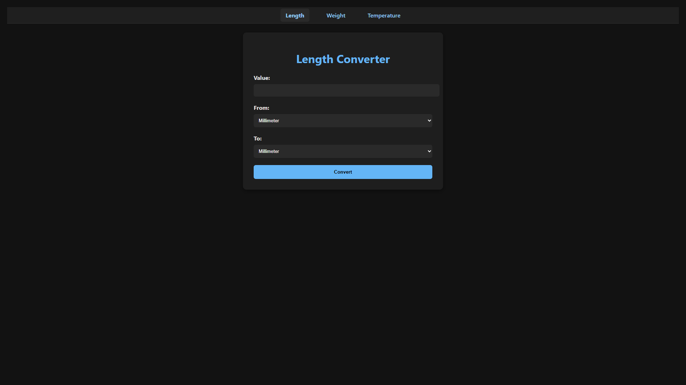
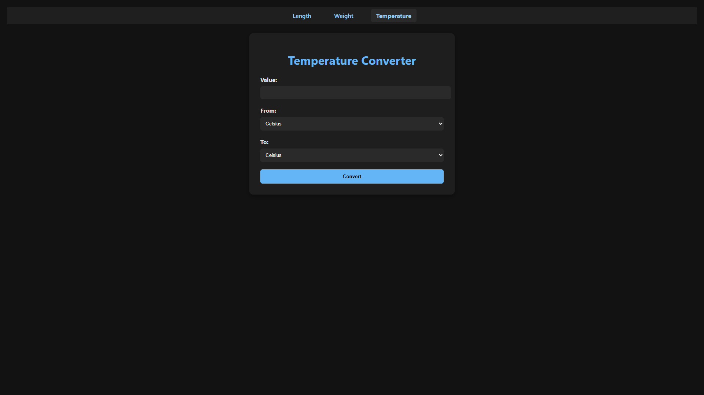

# 🌐 Unit Converter Web App

A simple Flask-based web application that allows users to convert between different units of **length**, **weight**, and **temperature** through a beautiful minimal dark-themed interface.

📌 [Project idea from roadmap.sh](https://roadmap.sh/projects/unit-converter)

---

## 🚀 Features

🔁 Convert values between:
- 📏 Length: millimeter, centimeter, meter, kilometer, inch, foot, yard, mile  
- ⚖️ Weight: milligram, gram, kilogram, ounce, pound  
- 🌡️ Temperature: Celsius, Fahrenheit, Kelvin

🖱️ Easy-to-use interface with dropdowns and number input  
🎨 Clean minimal **dark mode** UI  
⚠️ Built-in validation for invalid input  
🔁 Real-time conversion using POST requests  
🧠 No JavaScript, no database — just pure Flask and Python!

---

## ⚙️ How to Run

### 1. Clone this repository

```bash
git clone https://github.com/your-username/unit-converter-flask.git
cd unit-converter-flask
```

### 2. Install Flask

Make sure you have Python installed, then run:

```bash
pip install flask
```

### 3. Run the app

```bash
python app.py
```

Then open your browser and go to:

```
http://127.0.0.1:5000
```

---

## 🖼️ Screenshots

 

---

## 📁 Project Structure

```
unit-converter/
│
├── app.py                  # Main Flask application
├── static/
│   └── style.css           # CSS for dark mode styling
├── templates/
│   ├── length.html         # Length conversion page
│   ├── weight.html         # Weight conversion page
│   └── temperature.html    # Temperature conversion page
```

---

## 💡 Sample Code

**app.py:**
```python
@app.route('/length', methods=['GET', 'POST'])
def length():
    result = None
    error = None

    if request.method == 'POST':
        value, from_unit, to_unit, error = get_form_data()
        if error is None:
            value_in_meters = value * length_units[from_unit]
            result = round(value_in_meters / length_units[to_unit], 4)

    return render_template('length.html', result=result, error=error, active='length')
```

---

## 🧠 Skills Practiced

✅ Flask routing, forms, templates  
✅ Python logic for real-world conversions  
✅ Input validation with try/except  
✅ HTML, CSS layout and design  
✅ Clean code organization and modular structure

---

## 👤 Author

**Jurabek**  
High school student and aspiring AI Integration Specialist.  
Passionate about building Python web apps from scratch and mastering backend development with Flask and FastAPI.

---

> Built with ❤️ using Python and Flask
